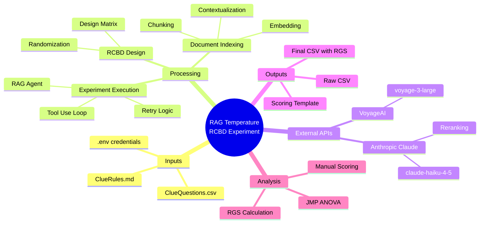

# RAG Temperature RCBD Experiment - Mermaid Diagrams

This directory contains Mermaid diagram specifications for documenting the RAG Temperature RCBD Experiment system. All diagrams are compatible with [mermaid.live](https://mermaid.live) and [mermaid.com](https://mermaid.com).

## Usage

### Option 1: Mermaid Live Editor
1. Go to [mermaid.live](https://mermaid.live)
2. Copy the Mermaid code block from any `.md` file
3. Paste into the editor to render and export

### Option 2: GitHub/GitLab Rendering
GitHub and GitLab natively render Mermaid diagrams in markdown files.

### Option 3: VS Code Extension
Install the "Markdown Preview Mermaid Support" extension.

## Diagram Index

### C4 Architecture Diagrams

| File | Diagram Type | Purpose |
|------|--------------|---------|
| [c4-context.md](c4-context.md) | C4 Context | System boundary and external actors |
| [c4-container.md](c4-container.md) | C4 Container | Internal containers and data stores |
| [c4-component.md](c4-component.md) | C4 Component | Detailed component breakdown |

### Behavioral Diagrams

| File | Diagram Type | Purpose |
|------|--------------|---------|
| [sequence-experiment-workflow.md](sequence-experiment-workflow.md) | Sequence | End-to-end experiment flow with phases |
| [state-rag-agent.md](state-rag-agent.md) | State | RAG agent tool use loop and error handling |

### Structural Diagrams

| File | Diagram Type | Purpose |
|------|--------------|---------|
| [class-diagram.md](class-diagram.md) | Class/UML | Classes, data structures, relationships |
| [er-diagram.md](er-diagram.md) | ER Diagram | Data model and CSV schema |

### Data Diagrams

| File | Diagram Type | Purpose |
|------|--------------|---------|
| [data-flow.md](data-flow.md) | Flowchart | Data transformations from input to output |

## System Overview



## Key Metrics

| Metric | Value | Source |
|--------|-------|--------|
| Questions | 31 | ClueQuestions.csv |
| Chunks | 8 | ClueRules.md |
| Temperature Levels | 3 | 0.3, 0.5, 0.8 |
| Total Runs | 93 | 31 x 3 |
| Blocking Factor | Question Type | S, M, F |
| Response Variable | RGS | C1 x (C2+C3+C4+C5) / 4 |

## Mermaid Diagram Types Used

| Type | Mermaid Directive | Files |
|------|-------------------|-------|
| C4 Context | `C4Context` | c4-context.md |
| C4 Container | `C4Container` | c4-container.md |
| C4 Component | `C4Component` | c4-component.md |
| Sequence | `sequenceDiagram` | sequence-experiment-workflow.md |
| State | `stateDiagram-v2` | state-rag-agent.md |
| Class | `classDiagram` | class-diagram.md |
| ER | `erDiagram` | er-diagram.md |
| Flowchart | `flowchart TB/LR` | data-flow.md |
| Mindmap | `mindmap` | README.md |

## Exporting Diagrams

### PNG/SVG Export
1. Open diagram in [mermaid.live](https://mermaid.live)
2. Click "Actions" > "Download PNG" or "Download SVG"

### PDF Export
1. Export as SVG
2. Use browser print-to-PDF or vector graphics software

### Batch Export
Use mermaid-cli for automation:
```bash
npm install -g @mermaid-js/mermaid-cli
mmdc -i diagram.md -o diagram.png
```
