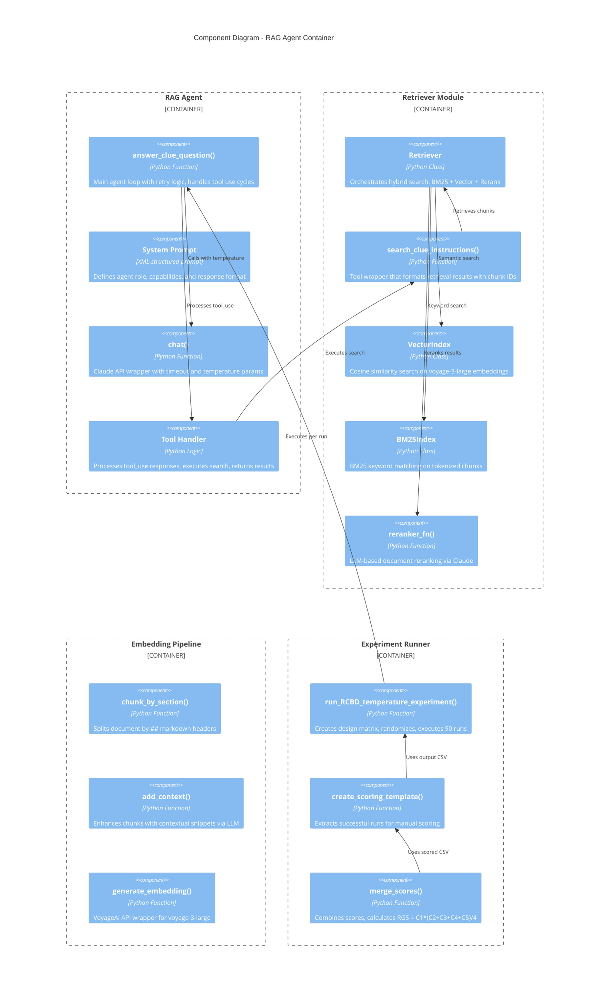

# C4 Component Diagram - RAG Temperature RCBD Experiment

## Description

This component diagram details the internal components within the RAG Agent and supporting containers.

### RAG Agent Components

| Component | Responsibility |
|-----------|----------------|
| `answer_clue_question()` | Main agent loop with max 5 iterations, 3 retries, timeout handling |
| System Prompt | XML-structured prompt defining agent behavior, citing requirements |
| `chat()` | Anthropic API wrapper accepting temperature, tools, timeout |
| Tool Handler | Processes `tool_use` stop reasons, routes to search function |

### Retriever Components

| Component | Responsibility |
|-----------|----------------|
| `Retriever` | Hybrid search orchestration (imported from retriever_implementation.py) |
| `search_clue_instructions()` | Tool interface returning JSON with chunk_id, content, score |
| `VectorIndex` | Cosine similarity on embeddings |
| `BM25Index` | Keyword frequency matching |
| `reranker_fn()` | LLM-based reranking using Claude |

### Embedding Pipeline Components

| Component | Responsibility |
|-----------|----------------|
| `chunk_by_section()` | Regex split on `\n## ` headers |
| `add_context()` | LLM-generated contextual prefixes |
| `generate_embedding()` | VoyageAI API call for voyage-3-large |

### Experiment Runner Components

| Component | Responsibility |
|-----------|----------------|
| `run_RCBD_temperature_experiment()` | Design matrix creation, randomization, execution loop |
| `create_scoring_template()` | Filters successful runs, creates scoring CSV |
| `merge_scores()` | Calculates RGS, generates final analysis CSV |
