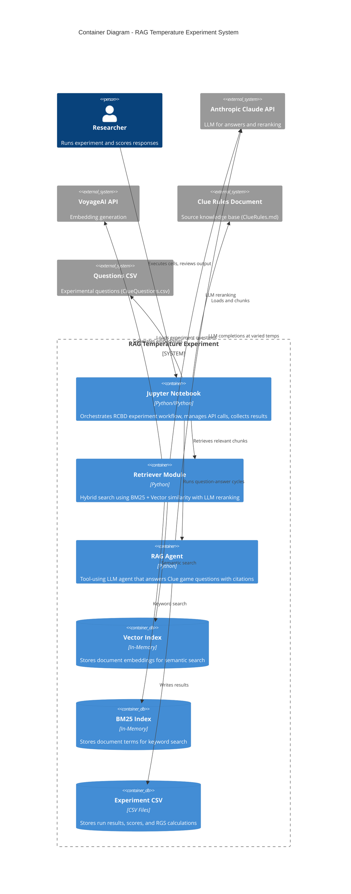

# C4 Container Diagram - RAG Temperature RCBD Experiment

## Description

This container diagram shows the internal containers within the RAG Temperature Experiment system.

### Containers

| Container | Technology | Purpose |
|-----------|------------|---------|
| Jupyter Notebook | Python/IPython | Main orchestration layer for the RCBD experiment |
| Retriever Module | Python | Hybrid retrieval combining BM25 and vector search |
| RAG Agent | Python | Tool-using agent that answers questions with citations |
| Vector Index | In-Memory | Stores voyage-3-large embeddings for semantic similarity |
| BM25 Index | In-Memory | Stores tokenized documents for keyword matching |
| Experiment CSV | CSV Files | Persists experiment results and scoring data |

### External Dependencies

| System | Purpose |
|--------|---------|
| Anthropic Claude API | claude-haiku-4-5 model for Q&A and reranking |
| VoyageAI API | voyage-3-large model for embeddings |
| Clue Rules Document | Source knowledge base (8 chunks) |
| Questions CSV | 31 experimental questions (S/M/F types) |

### Data Flow Summary
1. Notebook loads and chunks Clue rules
2. Chunks are embedded via VoyageAI and indexed
3. Questions are loaded from CSV
4. RCBD design matrix is created and randomized
5. RAG Agent processes each question at assigned temperature
6. Results are written to CSV for scoring and analysis
