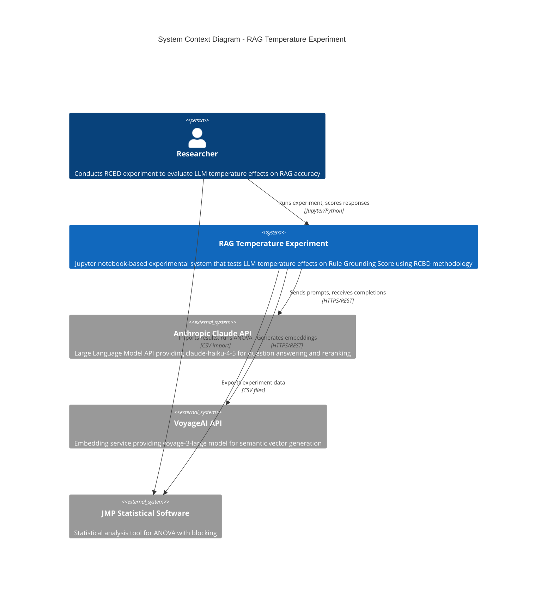

# C4 Context Diagram - RAG Temperature RCBD Experiment

## Description

This context diagram shows the RAG Temperature RCBD Experiment system and its interactions with external systems and users.

### Actors
- **Researcher**: The human operator who designs and runs the experiment, manually scores responses, and performs statistical analysis

### Systems
- **RAG Temperature Experiment**: The core Jupyter notebook system that orchestrates the RCBD experiment
- **Anthropic Claude API**: External LLM service for generating answers and reranking documents
- **VoyageAI API**: External embedding service for semantic search
- **JMP Statistical Software**: External tool for ANOVA analysis with blocking

### Key Relationships
1. Researcher interacts with the notebook to configure and run experiments
2. System calls Anthropic API for LLM completions at varying temperatures
3. System calls VoyageAI for document embeddings
4. Results are exported to CSV for JMP analysis
