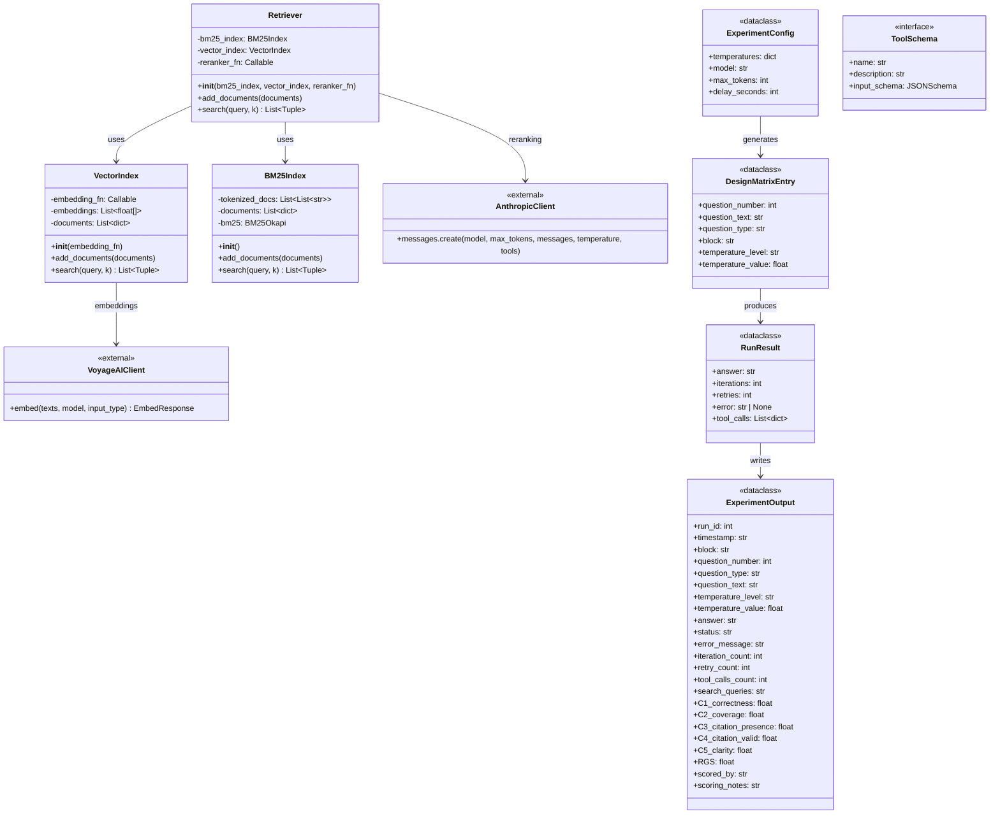

# Class Diagram - RAG Temperature Experiment



## Class Descriptions

### Retrieval Classes (from retriever_implementation.py)

| Class | Purpose |
|-------|---------|
| `VectorIndex` | Stores embeddings and performs cosine similarity search |
| `BM25Index` | Stores tokenized documents for BM25 keyword matching |
| `Retriever` | Orchestrates hybrid search with optional reranking |

### External Client Classes

| Class | Purpose |
|-------|---------|
| `AnthropicClient` | Official Anthropic SDK for Claude API calls |
| `VoyageAIClient` | VoyageAI SDK for embedding generation |

### Data Classes (Implicit in Notebook)

| Class | Purpose |
|-------|---------|
| `ExperimentConfig` | Temperature levels, model settings |
| `DesignMatrixEntry` | Single row in RCBD design matrix |
| `RunResult` | Return value from `answer_clue_question()` |
| `ExperimentOutput` | CSV row schema for experiment results |

### Tool Schema

| Field | Description |
|-------|-------------|
| `name` | "search_clue_instructions" |
| `description` | Tool purpose for Claude |
| `input_schema` | JSON Schema with `query` parameter |

## RGS Calculation

```
RGS = C1 x (C2 + C3 + C4 + C5) / 4
```

| Criterion | Description |
|-----------|-------------|
| C1 | Correctness (0 or 1) - Gates the entire score |
| C2 | Coverage (0-1) - Completeness of answer |
| C3 | Citation Presence (0-1) - Whether chunks are cited |
| C4 | Citation Valid (0-1) - Whether citations match content |
| C5 | Clarity (0-1) - Answer readability |
