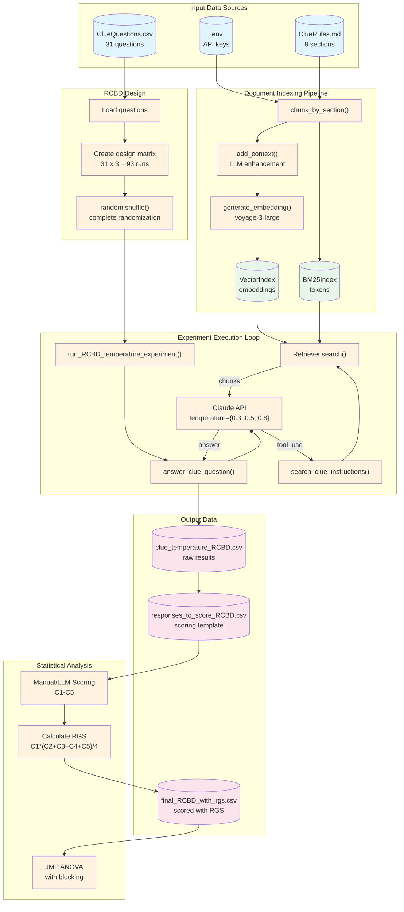
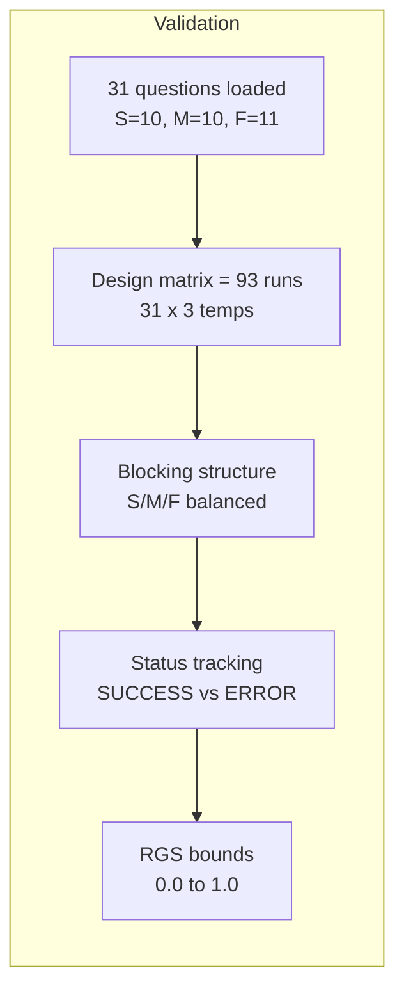

# Data Flow Diagram - RAG Temperature Experiment

## Data Transformation Summary

### Input Files

| File | Format | Contents |
|------|--------|----------|
| `ClueRules.md` | Markdown | Official Clue game rules (8 sections) |
| `ClueQuestions.csv` | CSV | 31 questions: Number, Question, Type (S/M/F) |
| `.env` | Dotenv | `VOYAGE_API_KEY`, `MODEL_NAME`, `MAX_TOKENS` |

### Intermediate Data Structures

| Structure | Type | Contents |
|-----------|------|----------|
| chunks | List[str] | 8 raw text chunks |
| contextualized_chunks | List[str] | 8 enhanced chunks with LLM context |
| embeddings | List[float[]] | 8 x 1024-dim vectors |
| design_matrix | List[dict] | 93 run specifications |

### Output Files

| File | Rows | Key Columns |
|------|------|-------------|
| `clue_temperature_RCBD.csv` | 93 | run_id, block, temp, answer, status |
| `responses_to_score_RCBD.csv` | ~93 | question, answer, C1-C5 (empty) |
| `final_RCBD_with_rgs.csv` | ~93 | All columns + RGS calculated |

## Data Quality Checkpoints

| Checkpoint | Validation |
|------------|------------|
| Question Load | Count by type: S=10, M=10, F=11 |
| Design Matrix | Total runs = questions x temperatures |
| Blocking | Each block has equal treatment coverage |
| Execution | Track success/failure by block and temp |
| Scoring | RGS in valid range, no missing C1-C5 |
