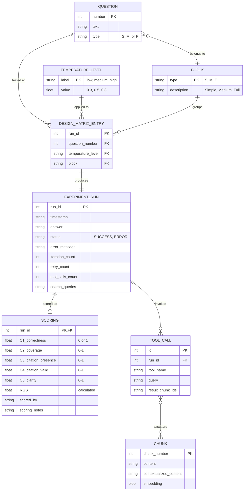
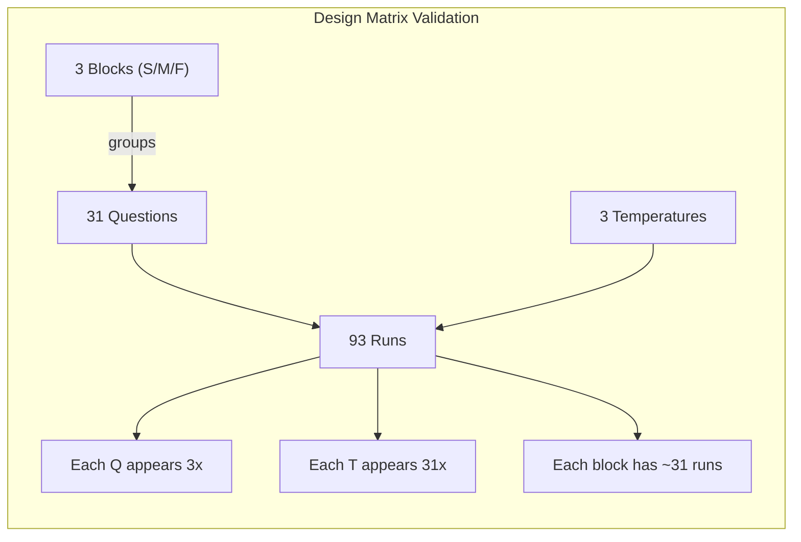

# Entity-Relationship Diagram - Experiment Data Model



## Entity Descriptions

### Core Entities

| Entity | Description | Cardinality |
|--------|-------------|-------------|
| QUESTION | Experimental questions loaded from CSV | 31 records |
| TEMPERATURE_LEVEL | Treatment factor levels | 3 records |
| BLOCK | Blocking factor (question types) | 3 records |
| DESIGN_MATRIX_ENTRY | Full factorial RCBD design | 93 records |
| EXPERIMENT_RUN | Execution results per run | 93 records |
| SCORING | Manual C1-C5 scores and RGS | 93 records |

### Supporting Entities

| Entity | Description | Cardinality |
|--------|-------------|-------------|
| CHUNK | Document chunks with embeddings | 8 records |
| TOOL_CALL | Search queries made during runs | Variable |

## CSV Schema Mapping

### clue_temperature_RCBD.csv

```
run_id | timestamp | block | question_number | question_type | question_text |
temperature_level | temperature_value | answer | status | error_message |
iteration_count | retry_count | tool_calls_count | search_queries |
C1_correctness | C2_coverage | C3_citation_presence | C4_citation_valid |
C5_clarity | RGS | scored_by | scoring_notes
```

### Relationships Cardinality

| Relationship | Type | Description |
|--------------|------|-------------|
| QUESTION to DESIGN_MATRIX_ENTRY | 1:N | Each question tested 3 times |
| TEMPERATURE_LEVEL to DESIGN_MATRIX_ENTRY | 1:N | Each temp applied 31 times |
| DESIGN_MATRIX_ENTRY to EXPERIMENT_RUN | 1:1 | Each entry run exactly once |
| EXPERIMENT_RUN to SCORING | 1:0..1 | Successful runs scored |
| EXPERIMENT_RUN to TOOL_CALL | 1:N | Each run may have multiple tool calls |

## RCBD Design Verification



| Validation | Expected | Formula |
|------------|----------|---------|
| Total runs | 93 | 31 questions x 3 temperatures |
| Runs per question | 3 | 1 per temperature level |
| Runs per temperature | 31 | 1 per question |
| Runs per block | ~31 | Depends on question distribution |
