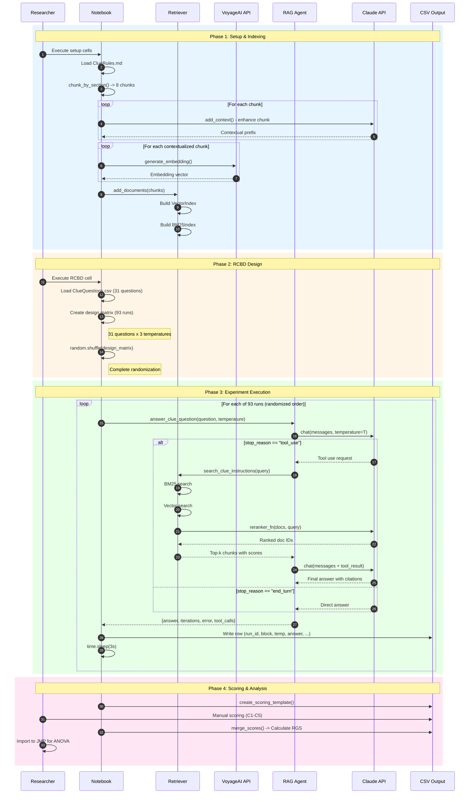

# Sequence Diagram - RCBD Experiment Workflow

## Workflow Phases

### Phase 1: Setup & Indexing
- Load Clue rules document (ClueRules.md)
- Split into 8 chunks by `## ` headers
- Enhance each chunk with LLM-generated context
- Generate embeddings via VoyageAI
- Build hybrid index (Vector + BM25)

### Phase 2: RCBD Design
- Load 31 experimental questions from CSV
- Create full factorial design matrix (31 x 3 = 93 runs)
- Apply complete randomization to eliminate order effects

### Phase 3: Experiment Execution (per run)
1. Call RAG Agent with question and assigned temperature
2. Agent queries Claude API
3. If tool use requested:
   - Execute hybrid search
   - Rerank results with LLM
   - Return to Claude with context
4. Record answer, metadata, tool calls to CSV
5. Delay 3 seconds between runs

### Phase 4: Scoring & Analysis
1. Create scoring template (successful runs only)
2. Manual scoring: C1-C5 criteria
3. Calculate RGS = C1 x (C2+C3+C4+C5) / 4
4. Import to JMP for blocked ANOVA

## Audit Trail

| Checkpoint | Data Captured |
|------------|---------------|
| Run Start | timestamp, run_id, block, question, temperature |
| Tool Call | search query, retrieved chunks |
| Run End | answer, iterations, retries, error status |
| Scoring | C1-C5 values, scorer identity, notes |
| Analysis | RGS calculation, statistical model |
