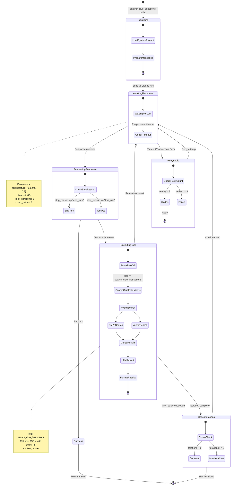
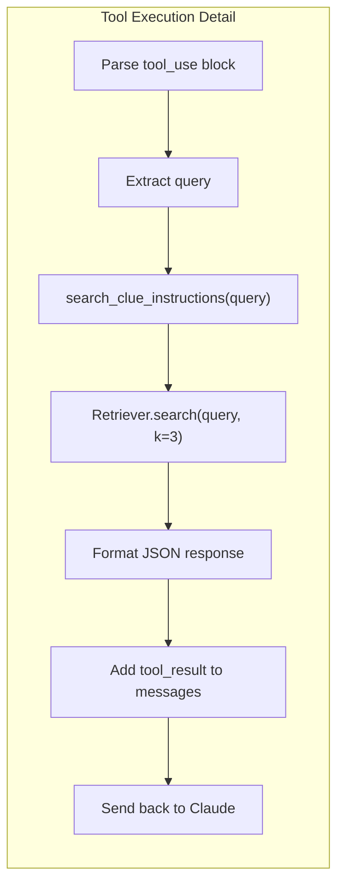

# State Diagram - RAG Agent Tool Use Loop



## Agent States

| State | Description |
|-------|-------------|
| **Initializing** | Load system prompt, prepare message list |
| **AwaitingResponse** | Waiting for Claude API response with timeout |
| **ProcessingResponse** | Check stop_reason to determine next action |
| **ExecutingTool** | Run search_clue_instructions with hybrid retrieval |
| **RetryLogic** | Handle timeout/connection errors with backoff |
| **CheckIterations** | Enforce max 5 tool use cycles |
| **Success** | Return complete answer with citations |

## Error Handling Matrix

| Error Type | Action | Recovery |
|------------|--------|----------|
| APITimeoutError | Retry if iteration=0 | Up to 3 retries |
| APIConnectionError | Retry if iteration=0 | Up to 3 retries |
| RateLimitError | Return error | No retry |
| Mid-conversation timeout | Return error | Cannot retry (state lost) |
| Tool execution error | Return JSON error | Continue iteration |
| Max iterations | Return apology | Graceful degradation |

## Tool Call Flow



## Return Value Structure

```json
{
    "answer": "According to CHUNK_X, ...",
    "iterations": 2,
    "retries": 0,
    "error": null,
    "tool_calls": [
        {"tool": "search_clue_instructions", "query": "player count"}
    ]
}
```
