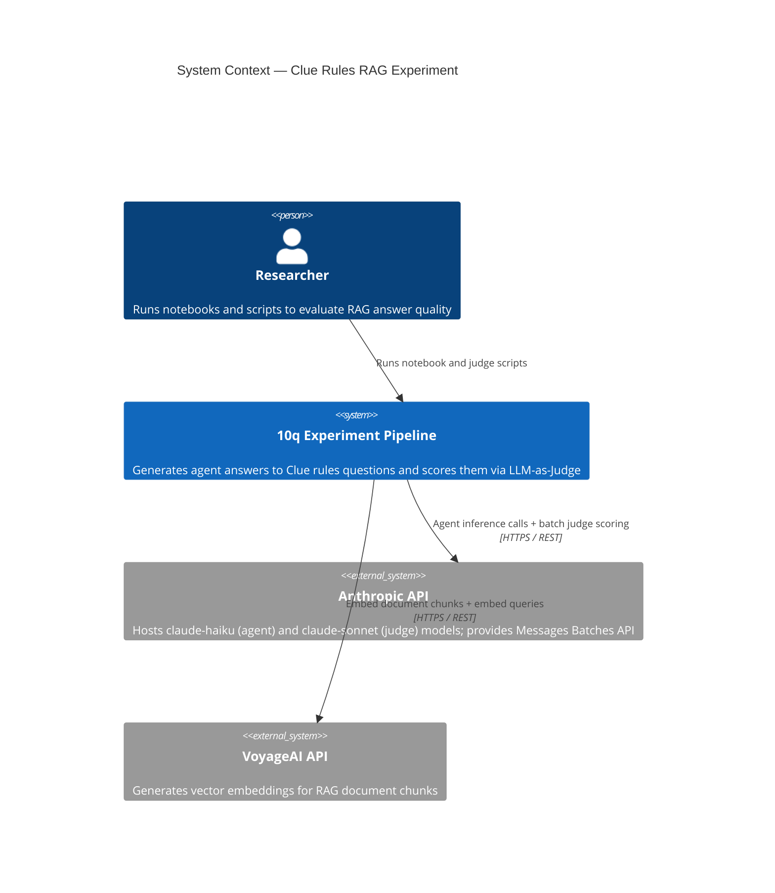
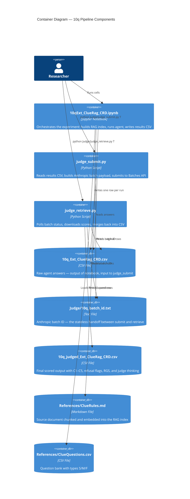
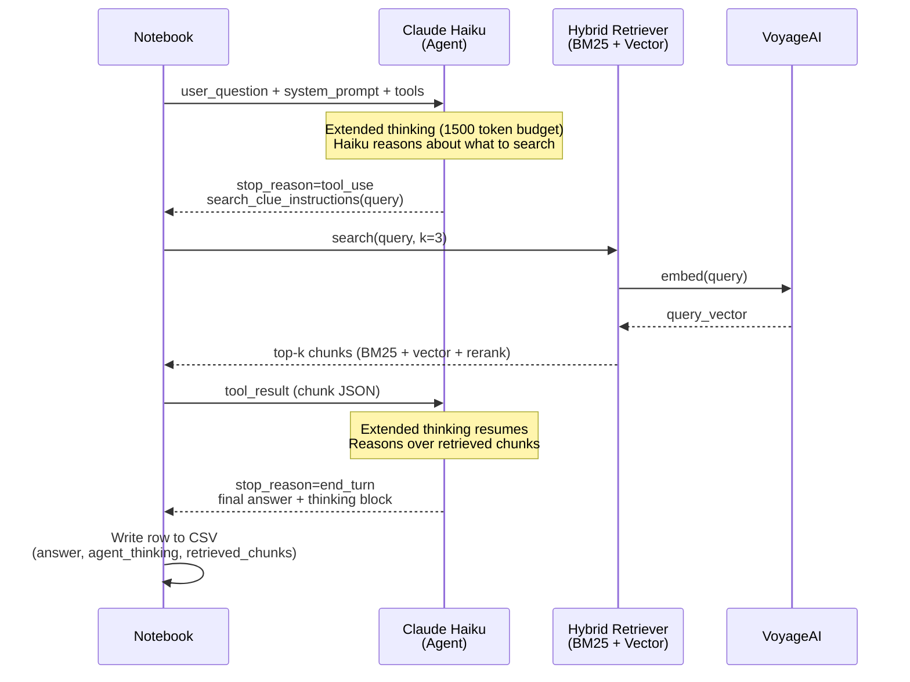
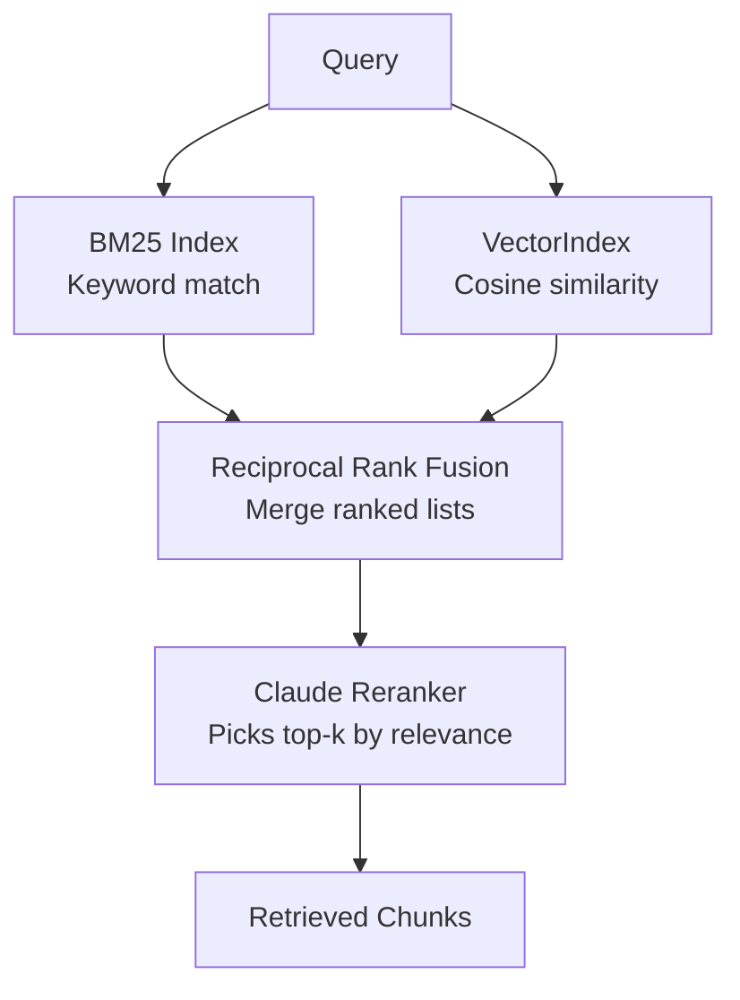
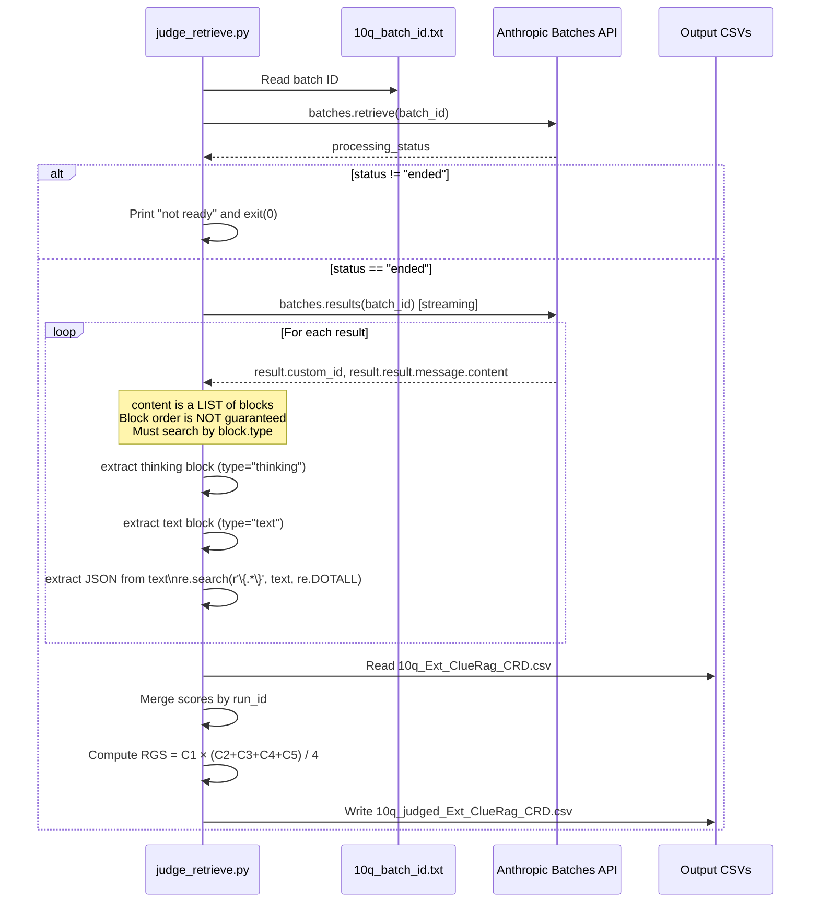

# 10q Test Pipeline — Technical Guide

**Audience:** Software engineers new to the project
**Scope:** The test harness that validates the full RAG → Agent → LLM-Judge pipeline
**Entry point:** `Notebooks/10qExt_ClueRag_CRD.ipynb`

---

## What Is the 10q Run?

The 10q run is a **pipeline smoke test** — it exercises the complete experiment flow against the first 10 questions with 1 replicate each (10 total agent invocations instead of the full 62+). It is designed to:

- Validate the RAG retriever is finding relevant chunks
- Confirm the agent is using extended thinking correctly
- Confirm the LLM judge can score the resulting CSV
- Catch token/model/API issues before committing to a full production run

**It is not a scientific experiment.** The sample size is too small for meaningful statistical inference. Its only purpose is pipeline & LLM as Judge validation and cost control.

---

## System Context (C4 Level 1)



---

## Container Architecture (C4 Level 2)



---

## Three-Phase Pipeline

The pipeline is split into three **deliberately decoupled phases**. Phases 2 and 3 are separate scripts (not notebook cells) because the Anthropic Batches API processes asynchronously — the batch is submitted, Anthropic processes it in the background (up to 1 hour), and only then can results be retrieved.

```mermaid
flowchart LR
    subgraph P1["Phase 1 — Experiment (Notebook)"]
        A[Load Questions] --> B[Build RAG Index]
        B --> C[Run Agent Loop x10]
        C --> D[Write CSV]
    end

    subgraph P2["Phase 2 — Judge Submit (Script)"]
        E[Read CSV] --> F[Build Batch Payload]
        F --> G[Submit to Anthropic]
        G --> H[Save Batch ID]
    end

    subgraph P3["Phase 3 — Judge Retrieve (Script)"]
        I[Read Batch ID] --> J{Batch ended?}
        J -- No --> K[Exit — wait and re-run]
        J -- Yes --> L[Stream Results]
        L --> M[Parse JSON Scores]
        M --> N[Merge into CSV]
    end

    D -->|10q_Ext_ClueRag_CRD.csv| E
    H -->|10q_batch_id.txt| I
    N -->|10q_judged_Ext_ClueRag_CRD.csv| O[Analysis / JMP]
```



---

## Phase 1 Internals — The Agent Loop

Each of the 10 questions goes through a multi-turn agentic loop. The agent has access to one tool: `search_clue_instructions`, which queries the hybrid RAG retriever.



### RAG Retriever Architecture

The retriever is a **hybrid** — it combines two independent ranking signals then reranks with Claude:



The document chunks are **contextualised** at index-build time: Claude prepends a situating sentence to each chunk so that the embedding captures the chunk's role in the document, not just its raw text. This is expensive (N API calls) but runs once per session.

---

## Phase 2 Internals — judge_submit.py

```mermaid
sequenceDiagram
    participant Script as judge_submit.py
    participant CSV as 10q_Ext_ClueRag_CRD.csv
    participant Cache as JudgeSystemPrompt.json
    participant API as Anthropic Batches API

    Script->>CSV: Read all rows where answer != ""
    Script->>Cache: Load system prompt text
    Note over Script: Wrap prompt with cache_control: ephemeral<br/>First request pays full token price;<br/>subsequent requests in batch reuse cache

    loop For each row
        Script->>Script: Build request\ncustom_id = "row_{run_id}"\nmodel=claude-sonnet-4-6\nmax_tokens=5000\nthinking.budget=2000
    end

    Script->>API: messages.batches.create(requests=[...])
    API-->>Script: batch.id = "msgbatch_..."
    Script->>Script: Write batch ID to Judge/10q_batch_id.txt
```

**Key design choices:**
- `custom_id = "row_{run_id}"` is the only link between batch results and CSV rows. It must match the `run_id` column exactly.
- `temperature=1.0` is **required** by the extended thinking API — not optional.
- Prompt caching is applied to the system prompt. All N requests share one cached copy after the first.

---

## Phase 3 Internals — judge_retrieve.py



### Why Block Type Search Matters

When extended thinking is enabled, the API returns content as an ordered list:

```
content[0] = ThinkingBlock  { type: "thinking", thinking: "..." }
content[1] = TextBlock      { type: "text",     text: "..." }
```

You **cannot** assume `content[0]` is the text. The retrieve script searches by `block.type` explicitly, making it safe regardless of block ordering.

---

## Scoring Schema

Each row in the judged CSV gains these columns:

| Column | Type | Description |
|--------|------|-------------|
| `C1_correctness` | 0/1 | Answer is factually correct |
| `C2_coverage` | 0/1 | Answer is sufficiently complete |
| `C3_citation_presence` | 0/1 | Answer contains at least one `CHUNK_N` reference |
| `C4_citation_valid` | 0/1 | Every cited chunk actually supports the answer |
| `C5_clarity` | 0/1 | Answer is fluent and natural |
| `CorrectRefusal` | 0/1 | Answer refused an out-of-scope question correctly |
| `ImproperRefusal` | 0/1 | Answer refused an in-scope question (error) |
| `ShouldHaveRefused` | 0/1 | Answer responded to out-of-scope question (error) |
| `reasoning_C1`–`reasoning_C5` | string | Judge's rationale per metric |
| `reasoning_refusal` | string | Judge's rationale for refusal flags |
| `judge_thinking` | string | Raw extended thinking from judge model |
| `RGS` | float | Retrieval-Grounded Score = C1 × (C2+C3+C4+C5) / 4 |

**RGS interpretation:** C1 gates everything — a wrong answer scores zero regardless of citation quality. The average of C2–C5 scales the correctness score by how well-grounded the answer is.

---

## Question Types

| Type | Meaning | Expected agent behaviour |
|------|---------|--------------------------|
| `S` | Straightforward — answer is directly in the rules | Should retrieve a relevant chunk and cite it |
| `M` | Marginal — answer requires inference from rules | May require multiple tool calls; citation validity is harder |
| `F` | Fabricated / out-of-scope | Should refuse; C3/C4/C5 set to 1 automatically by judge rubric |

---

## File Inventory

```
Project root/
├── Notebooks/
│   └── 10qExt_ClueRag_CRD.ipynb       # Phase 1 — run this first
│
├── Judge/
│   ├── judge_submit.py                  # Phase 2 — run after notebook
│   ├── judge_retrieve.py                # Phase 3 — run after batch completes
│   ├── JudgeSystemPrompt.json           # Judge scoring rubric
│   └── 10q_batch_id.txt                 # Auto-generated — do not edit
│
├── Output/
│   ├── 10q_Ext_ClueRag_CRD.csv          # Phase 1 output / Phase 2 input
│   └── 10q_judged_Ext_ClueRag_CRD.csv  # Phase 3 output — final scored data
│
├── References/
│   ├── ClueRules.md                     # RAG source document
│   └── ClueQuestions.csv                # Question bank (Number, Question, Type)
│
├── rag_helpers.py                        # Shared: build_clue_retriever(), tools[]
├── retriever_implementation.py           # Shared: VectorIndex, BM25Index, Retriever
├── llm_helpers.py                        # Shared: chat(), add_user_message(), etc.
└── .env                                  # API keys and model config — not committed
```

---

## How to Run

```bash
# From project root

# Phase 1 — run the notebook
# Open Notebooks/10qExt_ClueRag_CRD.ipynb and run all cells
# Output: Output/10q_Ext_ClueRag_CRD.csv

# Phase 2 — submit to judge (runs immediately, ~seconds)
python Judge/judge_submit.py T

# Phase 3 — retrieve scores (run after Anthropic finishes, typically < 1 hour)
python Judge/judge_retrieve.py T
# If batch not ready: script exits cleanly — just re-run later
# Output: Output/10q_judged_Ext_ClueRag_CRD.csv
```

---

## Environment Variables Required

| Variable | Used By | Purpose |
|----------|---------|---------|
| `ANTHROPIC_API_KEY` | Notebook, judge_submit, judge_retrieve | All Anthropic API calls |
| `VOYAGE_API_KEY` | Notebook | VoyageAI embedding calls |
| `MODEL_NAME` | Notebook | Agent model (e.g. `claude-haiku-4-5-20251001`) |
| `MAX_TOKENS` | Notebook | Agent max output tokens |
| `THINKING_BUDGET_TOKENS` | Notebook | Agent extended thinking budget |
| `JUDGE_MODEL_NAME` | judge_submit | Judge model (e.g. `claude-sonnet-4-6`) |
| `JUDGE_MAX_TOKENS` | judge_submit | Judge max output tokens — must be > thinking budget |
| `JUDGE_THINKING_BUDGET_TOKENS` | judge_submit | Judge extended thinking budget |

> **Token budget constraint:** `JUDGE_MAX_TOKENS` must be strictly greater than `JUDGE_THINKING_BUDGET_TOKENS`. The difference is the maximum token budget for visible judge output (reasoning tags + JSON). Minimum recommended: `JUDGE_MAX_TOKENS=5000`, `JUDGE_THINKING_BUDGET_TOKENS=2000`.
