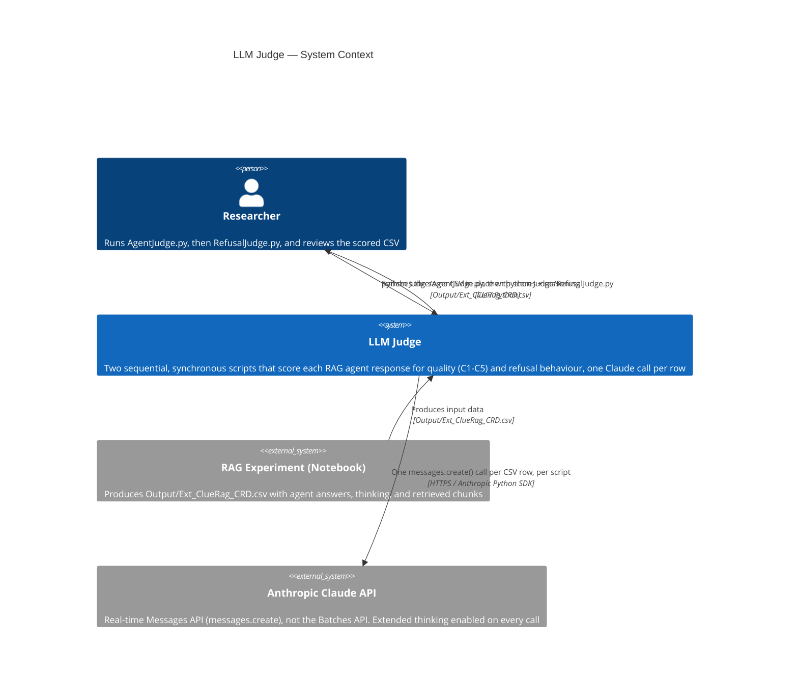
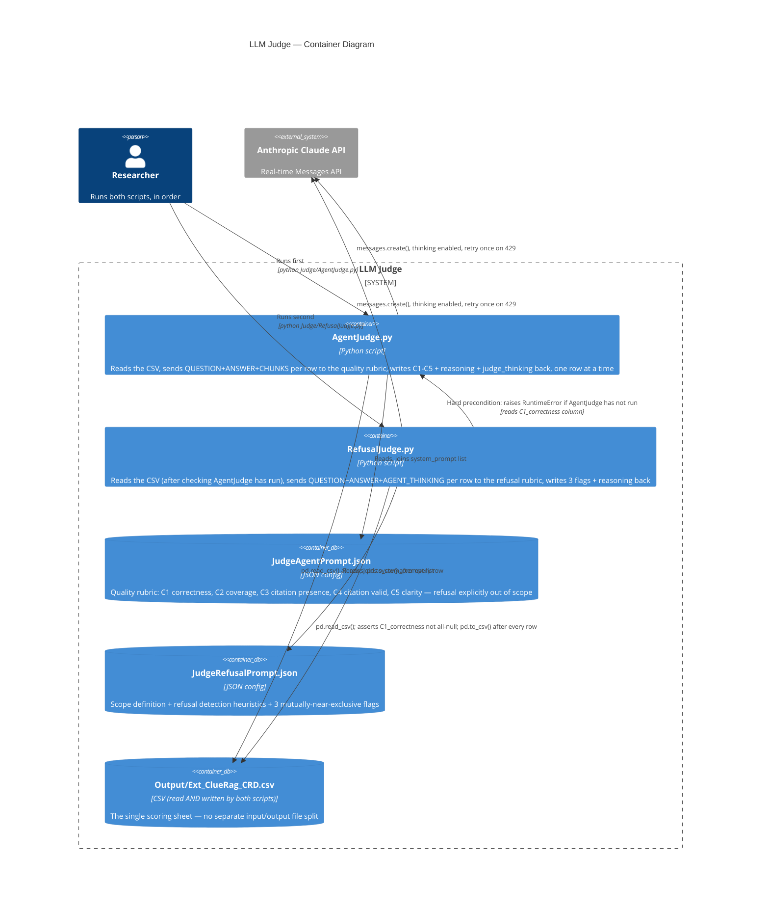
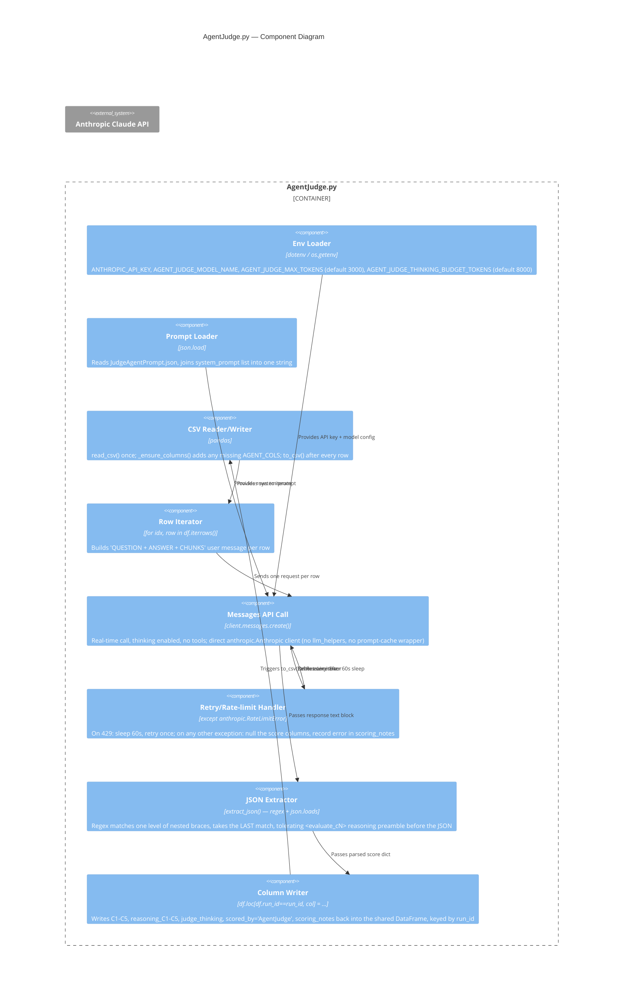
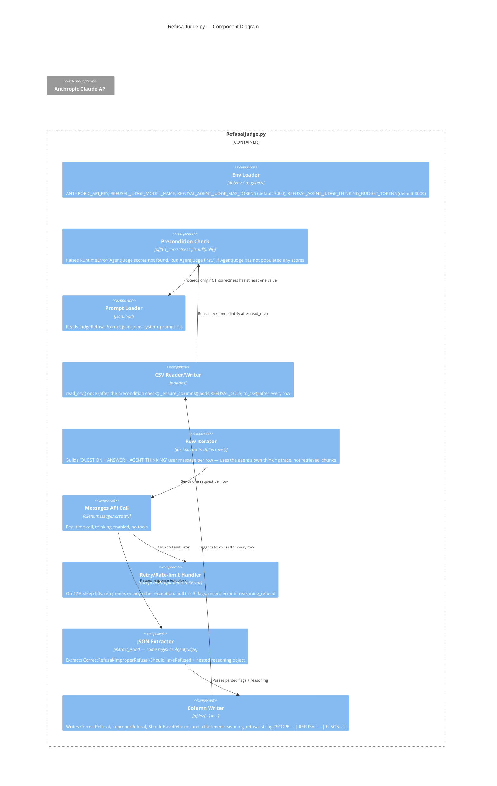

# LLM Judge — C4 Architecture Diagrams

> Rewritten for the current synchronous design (`AgentJudge.py` + `RefusalJudge.py`). The previous version of this file described the deleted async `judge_submit.py`/`judge_retrieve.py` Batches-API design — that design no longer exists in the codebase.

All diagrams use [Mermaid](https://mermaid.js.org/) and render in GitHub, VS Code (with Markdown Preview Mermaid Support), and [mermaid.live](https://mermaid.live).

---

## Level 1 — C4 Context

---

## Level 2 — C4 Container

**No `batch_id.txt`, no Batches API, no separate `judged_*.csv`.** Both scripts open the *same* file for both read and write, and the file is rewritten to disk after every single row (durability over throughput) rather than once at the end.

---

## Level 3 — C4 Component: AgentJudge.py

---

## Level 3 — C4 Component: RefusalJudge.py

---

## Diagram Notes

- Both scripts are near-duplicates of each other in structure; the meaningful differences are: (1) which prompt/rubric they load, (2) what evidence goes in the user message (`retrieved_chunks` for AgentJudge vs. `agent_thinking` for RefusalJudge), and (3) RefusalJudge's hard precondition on AgentJudge having already run.
- Neither script uses `llm_helpers.chat()` — they instantiate `anthropic.Anthropic()` directly, so they do **not** get the automatic prompt-caching wrapper that the notebook's agent/reranker/contextualizer calls get, even though the rubric system prompts are long and reused across all 62 rows.
- Config note to verify: `.env` defines the key as `REFUSAL_JUDGE_MODEL_NAME ` with a space before `=` (`REFUSAL_JUDGE_MODEL_NAME = claude-sonnet-4-6`). Most `python-dotenv` versions trim this correctly, but it's worth confirming `os.getenv("REFUSAL_JUDGE_MODEL_NAME")` actually resolves rather than silently returning `None` (which would pass `model=None` to `messages.create()` and fail loudly at call time, not silently).
- For the RAG agent, retriever, and notebook side of the pipeline, see [/Solution Documentation/diagrams/](../c4-context.md).
