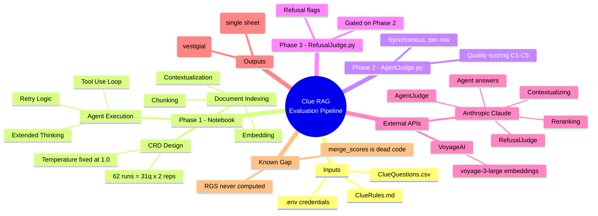

# Clue RAG Evaluation Pipeline - Mermaid Diagrams

This directory contains Mermaid diagram specifications documenting the current state of the pipeline on branch `feature/llm-judge-scoring-split` (synchronous Agent/Refusal judge split, CRD design). All diagrams render in GitHub, VS Code (Markdown Preview Mermaid Support), and [mermaid.live](https://mermaid.live).

## Diagram Index

### C4 Architecture Diagrams

| File | Diagram Type | Purpose |
|------|--------------|---------|
| [c4-context.md](c4-context.md) | C4 Context | System boundary, researcher, and external APIs |
| [c4-container.md](c4-container.md) | C4 Container | Notebook + AgentJudge.py + RefusalJudge.py + shared modules + config/data |
| [c4-component.md](c4-component.md) | C4 Component | Phase 1 (notebook) components — RAG agent, retriever, embedding pipeline, experiment runner |
| [Judge Design/c4-diagrams.md](Judge%20Design/c4-diagrams.md) | C4 Context/Container/Component | Judge subsystem in detail — AgentJudge.py and RefusalJudge.py |

### Behavioural Diagrams

| File | Diagram Type | Purpose |
|------|--------------|---------|
| [sequence-experiment-workflow.md](sequence-experiment-workflow.md) | **Sequence** | **Primary flow diagram** — end-to-end run across all 3 phases, including retry/rate-limit branches |
| [state-rag-agent.md](state-rag-agent.md) | State | RAG agent tool-use loop and error handling |

### Structural Diagrams

| File | Diagram Type | Purpose |
|------|--------------|---------|
| [class-diagram.md](class-diagram.md) | Class/UML | Classes, data structures, and script relationships |
| [er-diagram.md](er-diagram.md) | ER Diagram | Logical data model of the single CSV scoring sheet |

### Data Diagrams

| File | Diagram Type | Purpose |
|------|--------------|---------|
| [data-flow.md](data-flow.md) | Flowchart | Data transformations from input to output, including dead/vestigial paths |

## System Overview

## Key Facts

| Fact | Value | Source |
|------|-------|--------|
| Questions | 31 | `ClueQuestions.csv` |
| Chunks | ~8 | `ClueRules.md`, split on `## ` |
| Replicates | 2 per question | `run_CRD_experiment(replicates=2)` |
| Total Runs | 62 | 31 x 2 |
| Temperature | 1.0 (fixed, not a treatment) | required by Extended Thinking |
| Design | Completely Randomized Design (CRD) | not RCBD — no blocking/treatment factor is actively varied |
| Judge order | AgentJudge.py **then** RefusalJudge.py | `RefusalJudge.py` hard-fails if run first |
| Response variable (intended) | RGS = C1 x (C2+C3+C4+C5) / 4 | **currently never computed** — `merge_scores()` is dead code |

## Mermaid Diagram Types Used

| Type | Mermaid Directive | Files |
|------|-------------------|-------|
| C4 Context | `C4Context` | c4-context.md, Judge Design/c4-diagrams.md |
| C4 Container | `C4Container` | c4-container.md, Judge Design/c4-diagrams.md |
| C4 Component | `C4Component` | c4-component.md, Judge Design/c4-diagrams.md |
| Sequence | `sequenceDiagram` | sequence-experiment-workflow.md |
| State | `stateDiagram-v2` | state-rag-agent.md |
| Class | `classDiagram` | class-diagram.md |
| ER | `erDiagram` | er-diagram.md |
| Flowchart | `flowchart TB/LR` | data-flow.md |
| Mindmap | `mindmap` | README.md |

## Rendering / Exporting

- **mermaid.live**: paste any code block to render and export PNG/SVG.
- **GitHub/GitLab**: renders Mermaid natively in markdown.
- **VS Code**: install "Markdown Preview Mermaid Support".
- **Batch export**: `npm install -g @mermaid-js/mermaid-cli` then `mmdc -i diagram.md -o diagram.png`.

## Change History

These diagrams previously described an earlier (v1) design: an async, two-phase Judge on the Anthropic Batches API (`judge_submit.py`/`judge_retrieve.py`/`batch_id.txt`) and an RCBD experiment with a temperature treatment (0.3/0.5/0.8, 93 runs). That design was removed in commit `4c71a15`. All diagrams in this folder were rewritten against the current code to reflect the synchronous `AgentJudge.py`/`RefusalJudge.py` split and the CRD (fixed-temperature) design. See [PROJECT_OVERVIEW.md](../../PROJECT_OVERVIEW.md) for the 1-page solution summary.
