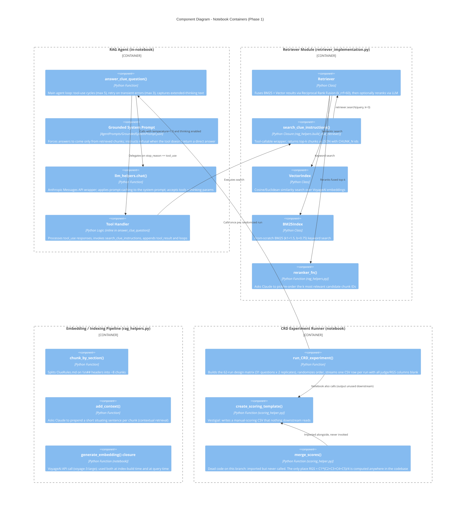

# C4 Component Diagram - Clue RAG Evaluation Pipeline

> Covers the **Phase 1 (notebook)** containers only. For the Judge subsystem's components (AgentJudge.py / RefusalJudge.py), see [Judge Design/c4-diagrams.md](Judge%20Design/c4-diagrams.md).

## Description

### RAG Agent Components

| Component | Responsibility |
|-----------|----------------|
| `answer_clue_question()` | Main agent loop: max 5 tool-use iterations, 3 retries on transient network errors, captures the `thinking` content block each turn |
| Grounded System Prompt | Defines `<answer_rules>` (source / no_answer / no_training_data / authority) — the active variant (`USE_GROUNDED_PROMPT = True`) |
| `llm_helpers.chat()` | Anthropic API wrapper; wraps `system` text in a `cache_control: ephemeral` block automatically |
| Tool Handler | Inline logic in `answer_clue_question()` that processes `tool_use` blocks and appends `tool_result` messages |

### Retriever Components

| Component | Responsibility |
|-----------|----------------|
| `Retriever` | RRF fusion of any number of `SearchIndex`-protocol sources, optional `reranker_fn` pass |
| `search_clue_instructions()` | The one tool exposed to the agent; returns JSON chunks with `CHUNK_N` ids |
| `VectorIndex` | Distance-based ranking over in-memory embeddings (lost on kernel restart — no vector DB) |
| `BM25Index` | Hand-rolled BM25 with a regex tokenizer |
| `reranker_fn()` | LLM call asking Claude to select/reorder candidate chunk ids |

### Embedding / Indexing Pipeline Components

| Component | Responsibility |
|-----------|----------------|
| `chunk_by_section()` | Regex split of `ClueRules.md` on `## ` headers |
| `add_context()` | LLM-generated contextual prefix per chunk, written to `Output/ContextualizedChunkedInstructions.txt` |
| `generate_embedding()` | VoyageAI `voyage-3-large` embedding call |

### CRD Experiment Runner Components

| Component | Responsibility |
|-----------|----------------|
| `run_CRD_experiment()` | Builds and randomizes the 62-run design matrix, streams the initial CSV (35 columns, judge/RGS columns blank) |
| `create_scoring_template()` | Still called every run; **output is not read by anything downstream** on this branch — treat as vestigial |
| `merge_scores()` | **Dead code**: imported in both notebooks, never called. It is the only code in the repository that computes RGS |

> For `AgentJudge.py` and `RefusalJudge.py` component-level detail (env/config loading, prompt loading, CSV row iteration, JSON extraction, retry-on-429 handling), see [Judge Design/c4-diagrams.md](Judge%20Design/c4-diagrams.md).
