# C4 Container Diagram - Clue RAG Evaluation Pipeline

```mermaid
C4Container
    title Container Diagram - Clue RAG Evaluation Pipeline

    Person(researcher, "Researcher", "Runs the notebook, then both judge scripts, in order")

    System_Boundary(system, "Clue RAG Evaluation Pipeline") {

        Container(notebook, "Ext_ClueRag_CRD.ipynb / 10qExt_ClueRag_CRD.ipynb", "Jupyter / Python", "Phase 1. Builds the hybrid retriever, runs the CRD design matrix (62 or 10 runs), writes the initial CSV row per run")

        Container(agent_judge, "AgentJudge.py", "Python script (CLI)", "Phase 2. Scores every row for quality (C1-C5) using QUESTION+ANSWER+CHUNKS. Rewrites the CSV in place after every row")

        Container(refusal_judge, "RefusalJudge.py", "Python script (CLI)", "Phase 3. Scores every row for refusal behaviour using QUESTION+ANSWER+AGENT_THINKING. Requires AgentJudge to have run first (checks C1_correctness is not all-null)")

        Container(llm_helpers, "llm_helpers.py", "Python module", "Anthropic Messages API wrapper with prompt caching, used by the notebook's agent/reranker/contextualizer calls")

        Container(rag_helpers, "rag_helpers.py", "Python module", "Chunking, contextualization, retriever factory, and shared tool schema — used only by the notebook")

        Container(retriever_impl, "retriever_implementation.py", "Python module", "Hybrid retrieval engine: BM25Index + VectorIndex + Reciprocal Rank Fusion + optional LLM rerank")

        Container(scoring_helper, "scoring_helper.py", "Python module (legacy)", "create_scoring_template() still called by the notebook but its output is unused downstream; merge_scores() (the only place RGS is computed) is imported but never called")

        ContainerDb(agent_prompts, "AgentPrompts/*.json", "JSON config", "systemPrompt.json / GroundedSystemPrompt.json — RAG agent persona; Grounded variant is active")

        ContainerDb(judge_prompts, "Judge/JudgeAgentPrompt.json, JudgeRefusalPrompt.json", "JSON config", "Scoring rubrics for AgentJudge and RefusalJudge respectively")

        ContainerDb(env, ".env", "Dotenv config", "API keys plus per-role model/token/thinking-budget settings (agent, agent-judge, refusal-judge)")

        ContainerDb(clue_rules, "References/ClueRules.md", "Markdown (git-ignored)", "RAG source document, chunked by ## headers into ~8 sections")

        ContainerDb(questions_csv, "References/ClueQuestions.csv", "CSV", "31 questions with Number/Question/Type (S/M/F)")

        ContainerDb(output_csv, "Output/Ext_ClueRag_CRD.csv", "CSV (single scoring sheet)", "The one file all three phases read and write, in place: agent output + quality scores + refusal scores + reasoning + judge thinking")
    }

    System_Ext(anthropic_api, "Anthropic Claude API", "LLM inference")
    System_Ext(voyageai_api, "VoyageAI API", "Embeddings")

    Rel(researcher, notebook, "Runs cells (Phase 1)")
    Rel(researcher, agent_judge, "python Judge/AgentJudge.py (Phase 2)")
    Rel(researcher, refusal_judge, "python Judge/RefusalJudge.py (Phase 3, after Phase 2)")

    Rel(notebook, rag_helpers, "Builds retriever, chunks & contextualizes ClueRules.md")
    Rel(notebook, llm_helpers, "chat() for agent answers, reranking, contextualizing")
    Rel(rag_helpers, retriever_impl, "Constructs Retriever(BM25Index, VectorIndex, reranker_fn)")
    Rel(notebook, scoring_helper, "Calls create_scoring_template() (vestigial); imports merge_scores() (dead code)")
    Rel(notebook, agent_prompts, "Loads active system prompt")
    Rel(notebook, clue_rules, "Loads and chunks")
    Rel(notebook, questions_csv, "Loads 31 questions, builds CRD design matrix")
    Rel(notebook, output_csv, "Writes one row per run, all judge/RGS columns blank")
    Rel(llm_helpers, anthropic_api, "Messages API (with prompt caching)")
    Rel(retriever_impl, voyageai_api, "Embeds chunks and queries", "via injected embedding_fn")

    Rel(agent_judge, judge_prompts, "Loads JudgeAgentPrompt.json")
    Rel(agent_judge, env, "Reads AGENT_JUDGE_* settings")
    Rel(agent_judge, output_csv, "Reads all rows; writes C1-C5, reasoning, judge_thinking after every row")
    Rel(agent_judge, anthropic_api, "Messages API, one call per row, extended thinking enabled")

    Rel(refusal_judge, judge_prompts, "Loads JudgeRefusalPrompt.json")
    Rel(refusal_judge, env, "Reads REFUSAL_*JUDGE_* settings")
    Rel(refusal_judge, output_csv, "Reads all rows (gated on C1_correctness); writes 3 refusal flags + reasoning after every row")
    Rel(refusal_judge, anthropic_api, "Messages API, one call per row, extended thinking enabled")

    UpdateLayoutConfig($c4ShapeInRow="3", $c4BoundaryInRow="1")
```

## Description

### Containers

| Container | Technology | Purpose |
|-----------|------------|---------|
| `Ext_ClueRag_CRD.ipynb` / `10qExt_ClueRag_CRD.ipynb` | Jupyter/Python | Phase 1 — builds the retriever, runs the CRD experiment, writes raw rows |
| `AgentJudge.py` | Python CLI script | Phase 2 — quality scoring (C1–C5), synchronous, per-row |
| `RefusalJudge.py` | Python CLI script | Phase 3 — refusal scoring, synchronous, per-row, gated on Phase 2 having run |
| `llm_helpers.py` | Python module | Shared Anthropic Messages API wrapper (notebook only) |
| `rag_helpers.py` | Python module | Chunking, contextualizing, retriever factory (notebook only) |
| `retriever_implementation.py` | Python module | Hybrid BM25 + vector retrieval with RRF fusion and optional LLM rerank |
| `scoring_helper.py` | Python module | Legacy manual-scoring helpers; mostly dead code on this branch (see notes) |

### Data / config containers

| Container | Purpose |
|-----------|---------|
| `AgentPrompts/*.json` | RAG agent system prompt (Grounded variant currently active) |
| `Judge/JudgeAgentPrompt.json` | AgentJudge rubric (C1–C5); **uncommitted edit in progress** loosening C3/C4 wording |
| `Judge/JudgeRefusalPrompt.json` | RefusalJudge rubric (scope + refusal detection + 3 flags) |
| `.env` | API keys + per-role model/max-tokens/thinking-budget settings |
| `References/ClueRules.md` | RAG knowledge base (git-ignored) |
| `References/ClueQuestions.csv` | 31-question bank (S/M/F types) |
| `Output/Ext_ClueRag_CRD.csv` | The single read-write data store shared by all three phases |

### Notable differences from the previous (v1) container design
- There is no `Judge/batch_id.txt` and no separate `judged_*.csv` — one CSV is enriched in place across all three phases.
- `AgentJudge.py`/`RefusalJudge.py` use the plain Anthropic client directly (`anthropic.Anthropic(...)`), not the `llm_helpers.chat()` wrapper, so judge calls do **not** get the automatic prompt-caching wrapper that agent/reranker/contextualizer calls get.
- `scoring_helper.py`'s `create_scoring_template()` still runs every notebook execution but its output (`Output/scoring_template_CRD.csv`) is not consumed by anything else — it is vestigial. `merge_scores()` (the only RGS calculation in the codebase) is imported but never called.
