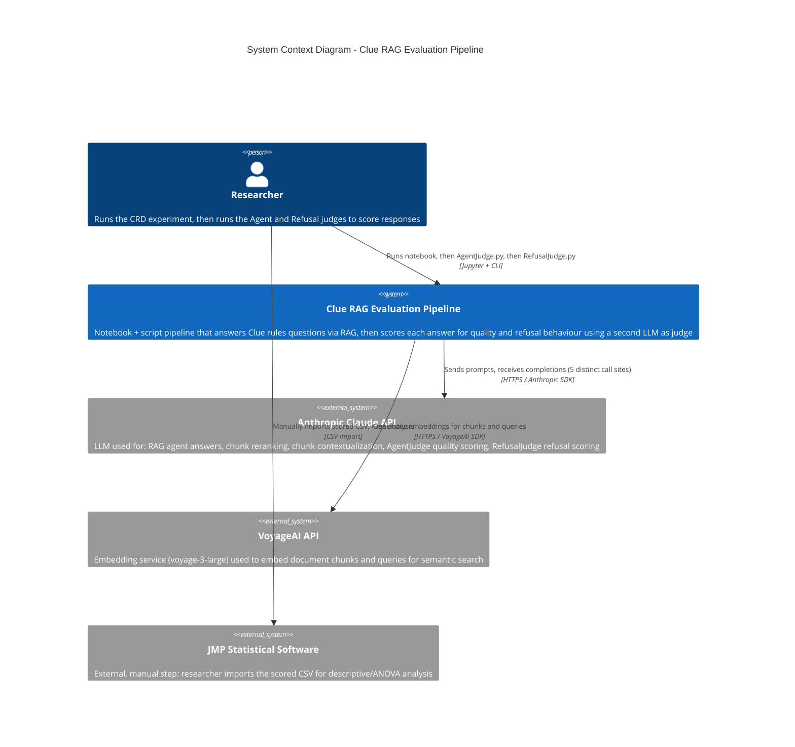

# C4 Context Diagram - Clue RAG Evaluation Pipeline

> Updated for branch `feature/llm-judge-scoring-split`. Superseded the RCBD/temperature-treatment framing — see [Diagram Notes](#diagram-notes).

## Description

### Actors
- **Researcher**: Runs all three phases by hand and in order — there is no orchestrator. Phase 1 (notebook) must complete before Phase 2 (`AgentJudge.py`), which must complete before Phase 3 (`RefusalJudge.py`) — `RefusalJudge.py` refuses to run if `C1_correctness` is entirely empty.

### Systems
- **Clue RAG Evaluation Pipeline**: The system documented here — a RAG agent that answers Clue rules questions, plus two sequential LLM-as-judge scripts that grade the agent's answers in place in a single CSV.
- **Anthropic Claude API**: The only LLM provider used. Called from five distinct places in the codebase (agent answering, reranking, chunk contextualizing, AgentJudge, RefusalJudge), each with its own model/token configuration in `.env`.
- **VoyageAI API**: Embedding-only; no vector database — embeddings live in an in-memory Python list for the life of the notebook kernel.
- **JMP**: Downstream, out-of-repo, manual. Not automated anywhere in this codebase.

## Diagram Notes

This diagram (and the rest of this folder) previously described an earlier design: an **async, two-phase Judge** built on the Anthropic **Batches API** (`judge_submit.py` → `judge_retrieve.py`), and an **RCBD design with a temperature treatment** (0.3/0.5/0.8, 93 runs). That design was deleted in commit `4c71a15` ("Judge logic split Agent/Refusal; single scoring sheet, synchronous now").

The **current** design, reflected here:
- **No Batches API.** `AgentJudge.py` and `RefusalJudge.py` call `client.messages.create()` synchronously, once per CSV row.
- **No temperature treatment.** Temperature is fixed at `1.0` (required by Extended Thinking) across all runs — this is a **Completely Randomized Design (CRD)**: 31 questions × 2 replicates = 62 runs, randomized order, no treatment factor, `question_type` (S/M/F) used only as a descriptive grouping.
- **RGS is not currently computed by any code path in this pipeline.** See [er-diagram.md](er-diagram.md) and [PROJECT_OVERVIEW.md](../../PROJECT_OVERVIEW.md) for details on this gap.
