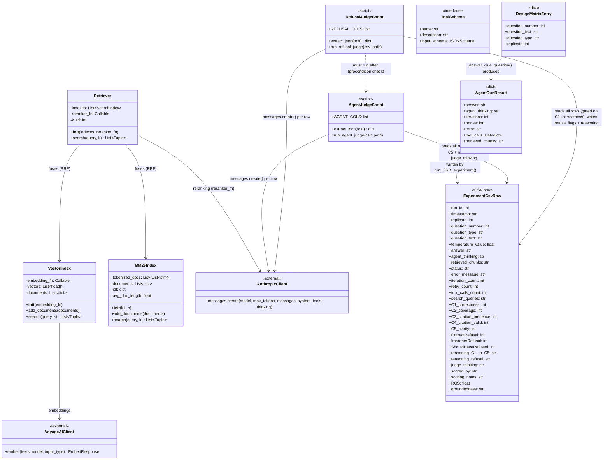

# Class Diagram - Clue RAG Evaluation Pipeline



## Class / Structure Descriptions

### Retrieval Classes (`retriever_implementation.py`)

| Class | Purpose |
|-------|---------|
| `VectorIndex` | Stores embeddings; cosine/Euclidean similarity search |
| `BM25Index` | Hand-rolled BM25 keyword search, no external library |
| `Retriever` | Orchestrates hybrid search: RRF fusion of any number of indexes, then optional LLM rerank |

### External Client Classes

| Class | Purpose |
|-------|---------|
| `AnthropicClient` | Official Anthropic SDK — used directly (agent/reranker/contextualizer via `llm_helpers`; both judges via a raw client, no caching wrapper) |
| `VoyageAIClient` | VoyageAI SDK for `voyage-3-large` embeddings |

### Data Structures (all plain dicts / DataFrame rows — no dataclasses in the codebase)

| Structure | Where | Purpose |
|-----------|-------|---------|
| `DesignMatrixEntry` | notebook | One randomized run spec: question + replicate |
| `AgentRunResult` | return of `answer_clue_question()` | Answer + thinking + iteration/retry/error metadata |
| `ExperimentCsvRow` | `Output/Ext_ClueRag_CRD.csv` | The full 35-column schema shared and mutated by all three phases |
| `ToolSchema` | `rag_helpers.tools` | The single tool (`search_clue_instructions`) exposed to the agent |

### Judge Scripts

| Script | Purpose |
|--------|---------|
| `AgentJudge.py` (`run_agent_judge`) | Phase 2 — quality scoring, synchronous, per-row CSV overwrite |
| `RefusalJudge.py` (`run_refusal_judge`) | Phase 3 — refusal scoring; hard-fails if Phase 2 hasn't run |

## RGS Calculation (defined, but dead on this branch)

```
RGS = C1 x (C2 + C3 + C4 + C5) / 4
```

This formula lives only in `scoring_helper.merge_scores()`, which is imported by both notebooks but **never called**. No script in the current pipeline populates the `RGS` column.
