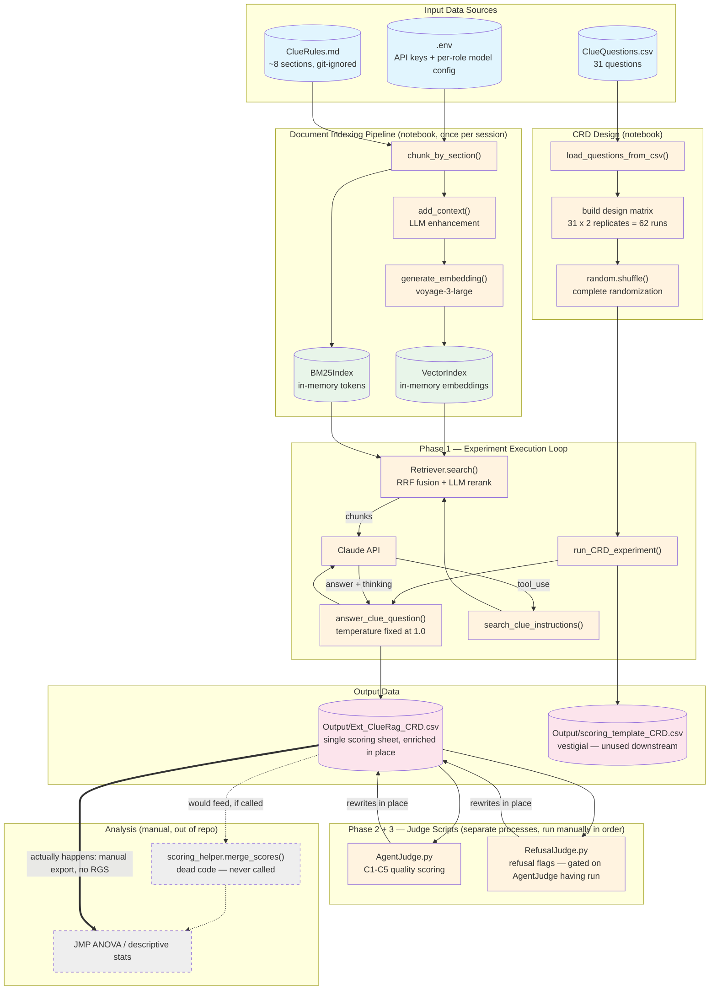
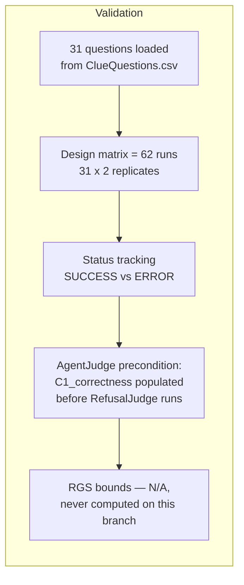

# Data Flow Diagram - Clue RAG Evaluation Pipeline

## Data Transformation Summary

### Input Files

| File | Format | Contents |
|------|--------|----------|
| `ClueRules.md` | Markdown (git-ignored) | Official Clue game rules, chunked on `## ` headers |
| `ClueQuestions.csv` | CSV | 31 questions: `Number, Question, Type` (S/M/F) |
| `.env` | Dotenv | API keys + per-role `MODEL_NAME`/`MAX_TOKENS`/`THINKING_BUDGET_TOKENS` for agent, AgentJudge, and RefusalJudge |

### Intermediate Data Structures

| Structure | Type | Contents |
|-----------|------|----------|
| chunks | List[str] | ~8 raw text chunks |
| contextualized_chunks | List[str] | ~8 chunks with LLM-generated situating sentence prepended |
| embeddings | List[float[]] | ~8 voyage-3-large vectors, in-memory only |
| design_matrix | List[dict] | 62 randomized run specifications |

### Output Files

| File | Rows | Notes |
|------|------|-------|
| `Output/Ext_ClueRag_CRD.csv` | 62 | The single file enriched in place across all 3 phases — no separate "judged" file exists |
| `Output/scoring_template_CRD.csv` | ~successful rows | Written by `create_scoring_template()`; **nothing downstream reads it** |

## Data Quality Checkpoints

| Checkpoint | Validation |
|------------|-------------|
| Question Load | Count by type printed (`S=.., M=.., F=..`) |
| Design Matrix | Total runs = questions x replicates = 62 |
| Execution | Track success/failure by question type |
| Judge Ordering | `RefusalJudge.py` raises `RuntimeError` if `C1_correctness` is entirely null |
| Scoring | RGS/groundedness left blank — no automated validation exists because nothing populates them |
