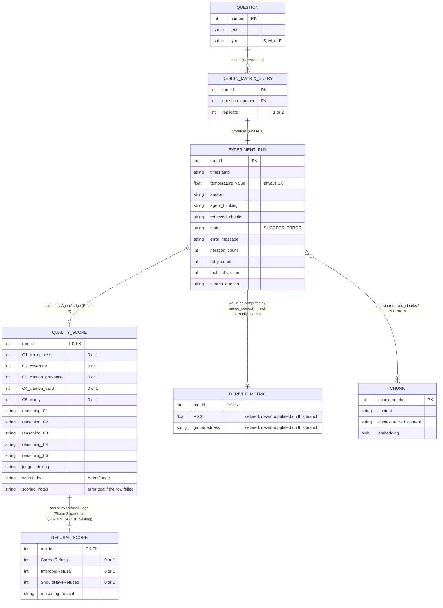
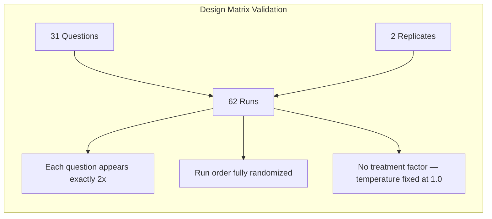

# Entity-Relationship Diagram - Experiment Data Model

> All entities below map onto a **single physical file**, `Output/Ext_ClueRag_CRD.csv` — there is no database and no separate "judged" CSV. The ER model is logical, showing how the 35 columns group conceptually and are populated by three different phases at three different times.



## Entity Descriptions

| Entity | Description | Cardinality | Populated by |
|--------|-------------|-------------|---------------|
| QUESTION | 31 questions loaded from `ClueQuestions.csv` | 31 records | input data, not written to output CSV directly |
| DESIGN_MATRIX_ENTRY | Randomized CRD run spec | 62 records (31 x 2 replicates) | `run_CRD_experiment()` |
| EXPERIMENT_RUN | Agent execution result | 62 records | Phase 1 (notebook) |
| QUALITY_SCORE | C1–C5 + reasoning + judge thinking | up to 62 records | Phase 2 (`AgentJudge.py`) |
| REFUSAL_SCORE | 3 refusal flags + reasoning | up to 62 records | Phase 3 (`RefusalJudge.py`), requires QUALITY_SCORE to exist first |
| DERIVED_METRIC | RGS / groundedness | **0 records on this branch** | nothing — `merge_scores()` is dead code |
| CHUNK | Document chunks with embeddings | ~8 records | Phase 1 setup, in-memory only (not persisted to CSV) |

## Full CSV Schema (`Output/Ext_ClueRag_CRD.csv`, 35 columns)

```
run_id | timestamp | replicate | question_number | question_type | question_text | temperature_value |
answer | agent_thinking | retrieved_chunks |
status | error_message | iteration_count | retry_count | tool_calls_count | search_queries |
C1_correctness | C2_coverage | C3_citation_presence | C4_citation_valid | C5_clarity |
CorrectRefusal | ImproperRefusal | ShouldHaveRefused |
reasoning_C1 | reasoning_C2 | reasoning_C3 | reasoning_C4 | reasoning_C5 | reasoning_refusal |
judge_thinking | scored_by | scoring_notes |
RGS | groundedness
```

## Relationship Cardinality

| Relationship | Type | Description |
|--------------|------|--------------|
| QUESTION → DESIGN_MATRIX_ENTRY | 1:2 | Each question appears exactly twice (2 replicates) |
| DESIGN_MATRIX_ENTRY → EXPERIMENT_RUN | 1:1 | Each design entry executes exactly once |
| EXPERIMENT_RUN → QUALITY_SCORE | 1:0..1 | Populated only after `AgentJudge.py` runs; failed API calls leave it null with an error in `scoring_notes` |
| QUALITY_SCORE → REFUSAL_SCORE | 1:0..1 | `RefusalJudge.py` raises `RuntimeError` if `C1_correctness` is entirely null — this is a hard precondition, not just an ordering convention |
| EXPERIMENT_RUN → DERIVED_METRIC | 1:0 | No code path currently populates this — documented as a known gap |

## Design Verification (CRD, not RCBD)



| Validation | Expected | Formula |
|------------|----------|---------|
| Total runs | 62 | 31 questions x 2 replicates |
| Runs per question | 2 | fixed replicate count |
| Treatment levels | 0 | temperature is fixed, not varied — this is a CRD with no active treatment factor |
| RGS bounds | n/a on this branch | RGS is never computed by the current pipeline |
