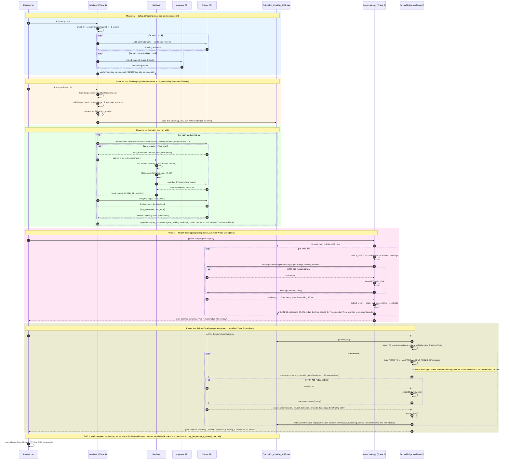

# Sequence Diagram - End-to-End Evaluation Flow

This is the primary behavioural diagram for the pipeline: one continuous run from indexing through Phase 1 (RAG agent), Phase 2 (`AgentJudge.py`) and Phase 3 (`RefusalJudge.py`). All three phases are run manually and sequentially by the researcher — there is no orchestrator, and each phase reads/writes the same CSV file (`Output/Ext_ClueRag_CRD.csv`).

## Workflow Phases

### Phase 1a — Setup & Indexing (once per notebook session)
Load `ClueRules.md` → chunk on `## ` headers → contextualize each chunk via Claude → embed via VoyageAI → build `Retriever(BM25Index, VectorIndex, reranker_fn)`. All in-memory; rebuilt every kernel restart.

### Phase 1b — CRD Design
This is a **Completely Randomized Design**, not the earlier RCBD/temperature design: temperature is fixed at `1.0` (an API constraint of Extended Thinking, not a treatment), 31 questions are each run twice (2 replicates), and the 62 runs are fully randomized. `question_type` (S/M/F) is recorded but is not a blocking factor in the current notebook logic.

### Phase 1c — Execution (per run)
`answer_clue_question()` drives up to 5 tool-use iterations per run, retries transient network errors up to 3 times, and writes one CSV row per run with the judge/RGS columns left blank.

### Phase 2 — AgentJudge.py (quality)
Runs standalone after Phase 1 finishes. Reads the whole CSV into a DataFrame, scores every row synchronously against `JudgeAgentPrompt.json` (C1 correctness, C2 coverage, C3 citation presence, C4 citation valid, C5 clarity), and **rewrites the entire CSV to disk after every single row** — durability over throughput. On a 429 it sleeps 60s and retries once; any other exception nulls the score columns for that row and records the error in `scoring_notes`.

### Phase 3 — RefusalJudge.py (refusal)
Refuses to start unless `AgentJudge.py` has already populated `C1_correctness`. Uses the **agent's own extended-thinking trace** (not the retrieved chunks) as supplementary scope evidence, and produces three flags: `CorrectRefusal`, `ImproperRefusal`, `ShouldHaveRefused`. Same per-row overwrite and retry-once-on-429 behaviour as Phase 2.

### Known gap — RGS
`RGS = C1 × (C2+C3+C4+C5) / 4` is defined in `scoring_helper.merge_scores()`, which is imported by both notebooks but **never called** anywhere in the current pipeline. The `RGS` and `groundedness` CSV columns exist in the header but are written as empty strings and never populated by `AgentJudge.py` or `RefusalJudge.py`. Any downstream statistical analysis currently has no RGS values to consume unless a human runs `merge_scores()` by hand.

## Audit Trail

| Checkpoint | Data Captured |
|------------|----------------|
| Run Start | `run_id`, `timestamp`, `replicate`, `question_number`, `question_type`, `question_text` |
| Tool Call | `search_queries`, `retrieved_chunks`, `tool_calls_count` |
| Run End (Phase 1) | `answer`, `agent_thinking`, `iteration_count`, `retry_count`, `status`, `error_message` |
| Quality Scoring (Phase 2) | `C1-C5`, `reasoning_C1-C5`, `judge_thinking`, `scored_by`, `scoring_notes` |
| Refusal Scoring (Phase 3) | `CorrectRefusal`, `ImproperRefusal`, `ShouldHaveRefused`, `reasoning_refusal` |
| Analysis (manual, not automated) | `RGS`, `groundedness` — currently always blank |
