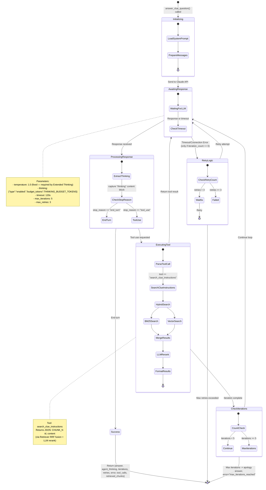
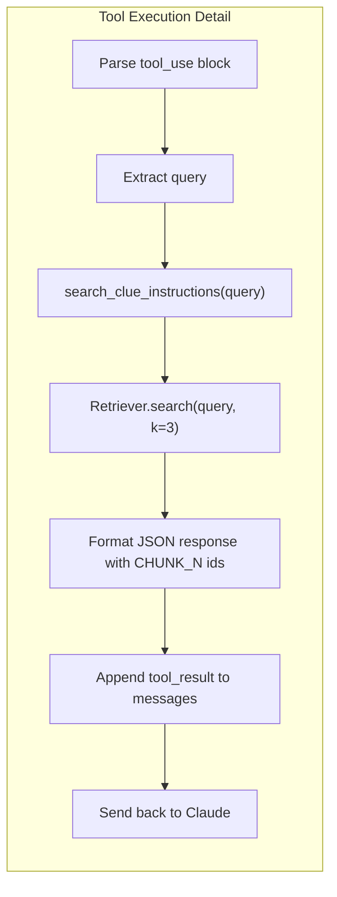

# State Diagram - RAG Agent Tool Use Loop



## Agent States

| State | Description |
|-------|-------------|
| **Initializing** | Load system prompt (Grounded variant), prepare message list |
| **AwaitingResponse** | Waiting for Claude API response with 120s timeout |
| **ProcessingResponse** | Extract `thinking` block, check `stop_reason` to determine next action |
| **ExecutingTool** | Run `search_clue_instructions` with hybrid retrieval + rerank |
| **RetryLogic** | Handle timeout/connection errors — only retryable if no iteration has started yet (mid-conversation timeouts cannot be retried, state is lost) |
| **CheckIterations** | Enforce max 5 tool-use cycles |
| **Success** | Return complete result dict including `agent_thinking` |

## Error Handling Matrix

| Error Type | Action | Recovery |
|------------|--------|----------|
| `APITimeoutError` / `APIConnectionError` | Retry only if `iteration_count == 0` | Up to 3 retries, 5s delay |
| Same errors mid-conversation (`iteration_count > 0`) | Return error immediately | Cannot retry — conversation state would be lost |
| `RateLimitError` | Return error immediately | No retry inside the agent loop |
| Tool execution error | Return JSON error as the tool_result | Continue the iteration loop |
| Max iterations (5) reached | Return apology answer | `error = "max_iterations_reached"` |

## Tool Call Flow



## Return Value Structure

```json
{
    "answer": "According to CHUNK_2, ...",
    "agent_thinking": "The user is asking about ...",
    "iterations": 2,
    "retries": 0,
    "error": null,
    "tool_calls": [
        {"tool": "search_clue_instructions", "query": "player count"}
    ],
    "retrieved_chunks": "..."
}
```
